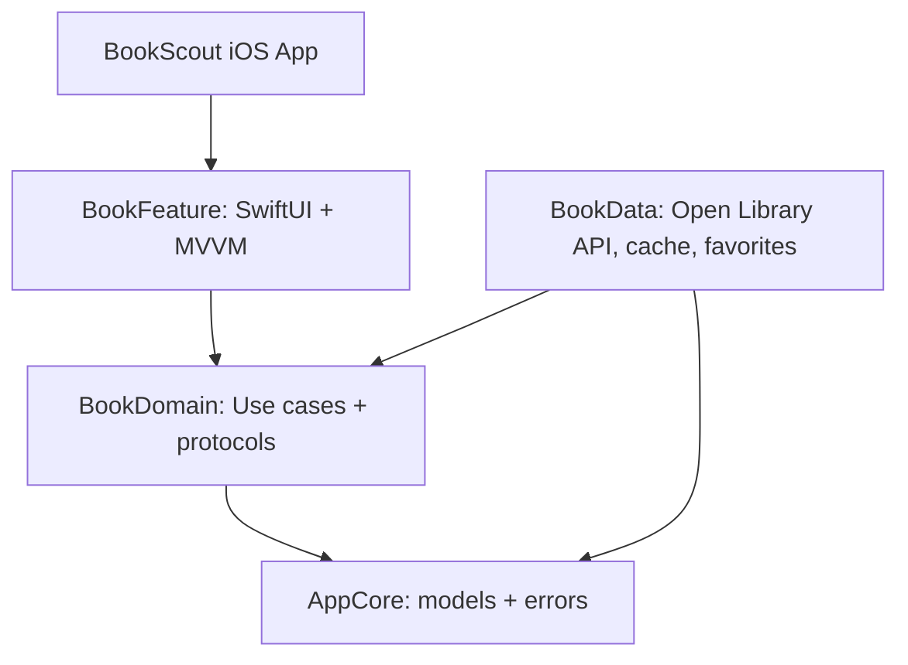

# BookScout

BookScout is a SwiftUI iOS app for exploring books from the public Open Library API. It supports paged search, subject filtering, detail navigation, favorites, disk caching, and graceful offline/error states.

## Assessment Summary

This project was built for the iOS Mobile Developer Technical Assessment. The app demonstrates a standalone data-driven mobile experience using SwiftUI, Swift Concurrency, MVVM, local persistence, network error handling, and a multi-module architecture.

## Requirements

- Xcode 26.4.1 or newer
- iOS 17.0+
- No API key required

## Setup

1. Open `BookScout.xcodeproj`.
2. Select the `BookScout` scheme.
3. Run on an iOS simulator or device.

For package verification:

```sh
swift test
```

For simulator build verification:

```sh
xcodebuild -project BookScout.xcodeproj -scheme BookScout -destination 'platform=iOS Simulator,name=iPhone 17,OS=26.4' build
```

## Architecture

The app uses Swift Package Manager modules plus a thin iOS app target:



- `AppCore`: shared entities and user-facing errors.
- `BookDomain`: repository contracts, favorites contract, and use cases.
- `BookData`: Open Library networking, first-page cache fallback, and `UserDefaults` favorites.
- `BookFeature`: SwiftUI list/detail screens and observable view model.
- `App`: composition root for dependency injection.

The dependency direction is intentionally inward: UI depends on domain abstractions, data implements those abstractions, and shared models/errors live in core. This keeps networking and persistence replaceable without changing the SwiftUI screens.

## Libraries Used

- SwiftUI and Observation for UI/state.
- Swift Concurrency for async data loading.
- Foundation `URLSession` for networking.
- Swift Testing for unit tests.

## Functional Coverage

- Data list interaction: Open Library search results are loaded in pages and navigate to detail views.
- Search and filtering: real-time debounced search plus subject filters.
- Persistence and state: favorite book IDs are saved in `UserDefaults`; first-page search results are cached to disk.
- Network and errors: offline fallback to cache, alert/content-unavailable states, and user-facing retry.

## AI Documentation

### Scope of Usage

AI was used as a development accelerator and review partner, not as an unchecked replacement for engineering decisions.

- Project scaffolding: generated the initial Swift Package module layout and thin Xcode app target.
- Architecture planning: compared module boundaries for `AppCore`, `BookDomain`, `BookData`, and `BookFeature`.
- UI iteration: helped identify and fix the navigation/title blur caused by the filter bar being placed in a top safe-area overlay.
- Unit tests: assisted with small focused tests for the search use case and favorites persistence.
- Documentation: helped draft and refine the README, architecture explanation, and assessment checklist mapping.

The final module boundaries, implementation details, UI fixes, and verification steps were manually reviewed before submission.

### Prompt Examples

1. "Create a SwiftUI technical assessment app using multi-module SPM architecture, MVVM, async/await, Open Library API paging, search, favorites, local cache fallback, and graceful error handling. Keep domain protocols independent from networking and UI."
2. "Review this Swift package for concurrency, testability, and separation-of-concerns issues before submission. Pay special attention to dependency direction, offline behavior, user-facing error states, and whether the README clearly answers the assessment requirements."
3. "The SwiftUI title is blurred/hidden because the filter chips appear too high under the status bar. Inspect the layout and suggest a cleaner fix that preserves the large navigation title."

### Verification Process

AI-generated or AI-assisted code was validated with the following process:

- Manual code review: checked each generated file for readability, naming consistency, and unnecessary abstractions.
- Architecture review: confirmed that `BookFeature` talks to `BookDomain` use cases, while `BookData` implements repository/storage protocols.
- Compile and test checks: ran `swift test` and an iOS simulator build with `xcodebuild`.
- Runtime validation: installed and launched the app on an iPhone simulator, then inspected the UI after data loaded.
- Error-path review: checked API failure handling, decoding failures, offline fallback behavior, and empty-result messaging.
- Persistence review: verified favorites storage with an isolated `UserDefaults` test suite so tests do not pollute real app preferences.

Commands used:

```sh
swift test
xcodebuild -project BookScout.xcodeproj -scheme BookScout -destination 'platform=iOS Simulator,name=iPhone 17,OS=26.4' build
```

### Reflection

AI improved productivity most during the repetitive parts of the task: package scaffolding, README structure, test setup, and quick iteration on SwiftUI layout issues. It also helped surface risks that are easy to miss in a 48-hour assessment, such as dependency direction, offline fallback behavior, and whether the documentation explicitly maps to the evaluation criteria.

The tradeoff is that AI output still needs disciplined verification. Some generated SwiftUI code needed simplification for compiler performance and layout correctness. Treating AI as a fast collaborator, then validating with tests, builds, simulator runs, and manual review, produced a stronger final architecture than using either AI or manual implementation alone.
