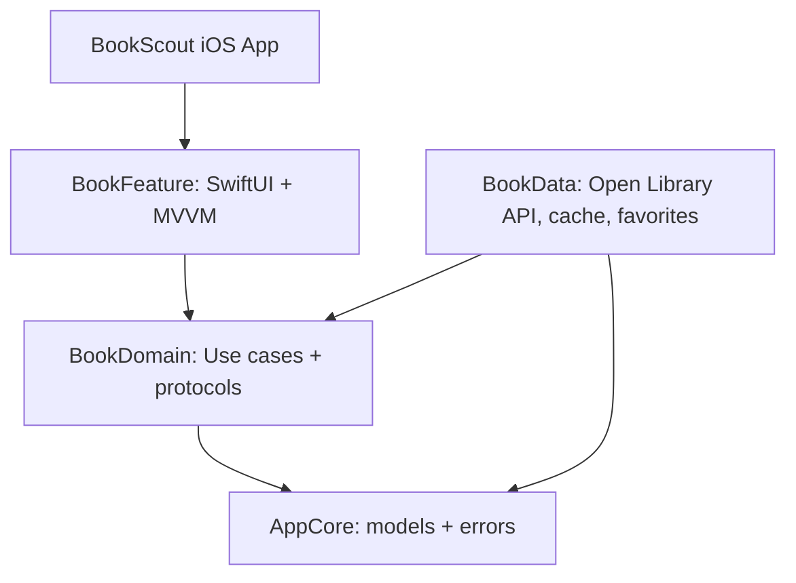

# BookScout

BookScout is a SwiftUI iOS app for exploring books from the public Open Library API. It supports paged search, subject filtering, detail navigation, favorites, disk caching, and graceful offline/error states.

## Requirements

- Xcode 26.4.1 or newer
- iOS 17.0+
- No API key required

## Setup

1. Open `BookScout.xcodeproj`.
2. Select the `BookScout` scheme.
3. Run on an iOS simulator or device.

For package verification:

```sh
swift test
```

## Architecture

The app uses Swift Package Manager modules plus a thin iOS app target:



- `AppCore`: shared entities and user-facing errors.
- `BookDomain`: repository contracts, favorites contract, and use cases.
- `BookData`: Open Library networking, first-page cache fallback, and `UserDefaults` favorites.
- `BookFeature`: SwiftUI list/detail screens and observable view model.
- `App`: composition root for dependency injection.

## Libraries Used

- SwiftUI and Observation for UI/state.
- Swift Concurrency for async data loading.
- Foundation `URLSession` for networking.
- Swift Testing for unit tests.

## Functional Coverage

- Data list interaction: Open Library search results are loaded in pages and navigate to detail views.
- Search and filtering: real-time debounced search plus subject filters.
- Persistence and state: favorite book IDs are saved in `UserDefaults`; first-page search results are cached to disk.
- Network and errors: offline fallback to cache, alert/content-unavailable states, and user-facing retry.

## AI Documentation

### Scope of Usage

AI was used to accelerate project scaffolding, module boundary planning, README drafting, and focused unit-test generation. The app logic, architecture choices, and final verification were reviewed manually.

### Prompt Examples

1. "Create a SwiftUI technical assessment app using multi-module SPM architecture, MVVM, async/await, Open Library API paging, search, favorites, and offline cache."
2. "Review this Swift package for concurrency, testability, and separation-of-concerns issues before I submit it as a mobile developer assessment."

### Verification Process

Generated code was validated by reading each module boundary, checking that dependencies point inward toward the domain layer, running `swift test`, and reviewing networking/error paths for offline behavior and decoding failures. Persistence code is covered by a unit test using an isolated `UserDefaults` suite.

### Reflection

AI reduced boilerplate time and helped pressure-test the architecture quickly. The biggest quality gain came from using AI as a second reviewer for edge cases while keeping final decisions grounded in compile checks, tests, and manual code review.
